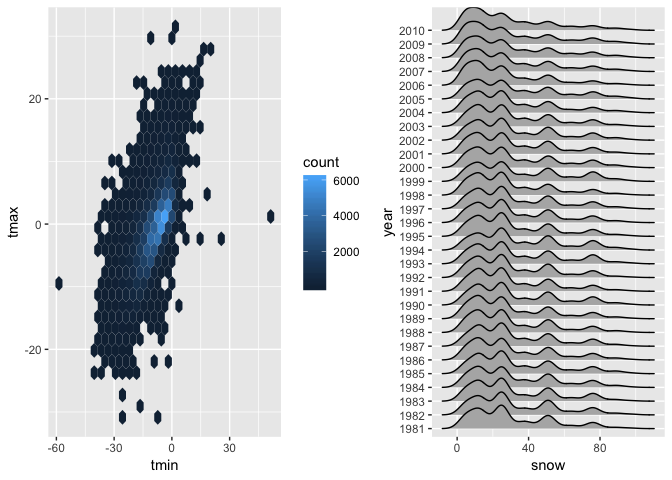

p8105\_hw3\_db3180
================
Divya Bisht
10/9/2018

``` r
#install.packages("hexbin")
#install.packages("ggridges")
#install.packages("devtools")
```

Problem 1
---------

``` r
devtools::install_github("p8105/p8105.datasets")
```

    ## Skipping install of 'p8105.datasets' from a github remote, the SHA1 (21f5ad1c) has not changed since last install.
    ##   Use `force = TRUE` to force installation

``` r
library(p8105.datasets)
brfss_data = brfss_smart2010 %>%
  janitor::clean_names() %>% 
  filter(topic == "Overall Health") %>% 
  rename(state = locationabbr, county = locationdesc) %>%
  janitor::clean_names() %>% 
  mutate(response = factor(response, levels = c("Excellent",  "Very good", "Good", "Fair", "Poor")))
```

``` r
brfss_data %>% 
  janitor::clean_names() %>%
  filter(year == 2002) %>%
  group_by(state) %>% 
  distinct(state, county) %>% 
  summarize(n = n()) %>% 
  arrange(desc(n))
```

    ## # A tibble: 49 x 2
    ##    state     n
    ##    <chr> <int>
    ##  1 PA       10
    ##  2 MA        8
    ##  3 NJ        8
    ##  4 CT        7
    ##  5 FL        7
    ##  6 NC        7
    ##  7 MD        6
    ##  8 NH        5
    ##  9 NY        5
    ## 10 UT        5
    ## # ... with 39 more rows

CT, FL, and NC were the states that were observed at 7 locations.

``` r
brfss_data %>%
  group_by(state, year) %>% 
  summarize(locations = n()) %>% 
    
    ggplot(aes(x = year, y = locations, color = state)) + 
    geom_line()
```

 Table showing: for the years 2002, 2006, and 2010, the mean and standard deviation of the proportion of “Excellent” responses across locations in NY State.

``` r
brfss_data %>%
  filter(year == 2002 | year == 2006 | year == 2010, state == "NY") %>% 
  spread(response, data_value) %>% 
  janitor::clean_names() %>% 
  group_by(state, county, year) %>% 
  summarize(mean_excellent = mean(excellent, na.rm = TRUE),
             sd_excellent = sd(excellent, na.rm = TRUE)) %>% 
  knitr::kable()
```

| state | county                  |  year|  mean\_excellent|  sd\_excellent|
|:------|:------------------------|-----:|----------------:|--------------:|
| NY    | NY - Bronx County       |  2010|             17.6|             NA|
| NY    | NY - Erie County        |  2010|             17.2|             NA|
| NY    | NY - Kings County       |  2002|             19.5|             NA|
| NY    | NY - Kings County       |  2006|             19.2|             NA|
| NY    | NY - Kings County       |  2010|             22.4|             NA|
| NY    | NY - Monroe County      |  2010|             22.4|             NA|
| NY    | NY - Nassau County      |  2002|             26.9|             NA|
| NY    | NY - Nassau County      |  2006|             21.7|             NA|
| NY    | NY - Nassau County      |  2010|             26.2|             NA|
| NY    | NY - New York County    |  2002|             27.9|             NA|
| NY    | NY - New York County    |  2006|             28.8|             NA|
| NY    | NY - New York County    |  2010|             25.8|             NA|
| NY    | NY - Queens County      |  2002|             18.8|             NA|
| NY    | NY - Queens County      |  2006|             18.9|             NA|
| NY    | NY - Queens County      |  2010|             21.2|             NA|
| NY    | NY - Suffolk County     |  2002|             27.1|             NA|
| NY    | NY - Suffolk County     |  2006|             20.6|             NA|
| NY    | NY - Suffolk County     |  2010|             24.6|             NA|
| NY    | NY - Westchester County |  2006|             26.0|             NA|
| NY    | NY - Westchester County |  2010|             26.9|             NA|

For each year and state, compute the average proportion in each response category (taking the average across locations in a state). Make a five-panel plot that shows, for each response category separately, the distribution of these state-level averages over time.

``` r
brfss_data %>%
  spread(response, data_value) %>% 
  group_by(state, year) %>% 
  janitor::clean_names() %>%
  summarize(mean_excellent = mean(excellent, na.rm = TRUE), 
            mean_verygood = mean(very_good, na.rm = TRUE), 
            mean_good = mean(good, na.rm = TRUE), 
            mean_fair = mean(fair, na.rm = TRUE), 
            mean_poor = mean(poor, na.rm = TRUE)) %>%
  gather(response, data_values, mean_excellent, mean_verygood, mean_good, mean_fair, mean_poor) %>% 
  
  ggplot(aes(x = year, y = data_values, color = state)) +
  geom_line() + 
  facet_grid(~response)
```


Problem 2
---------

``` r
instacart_data = instacart %>%
  janitor::clean_names()
```

This dataset has 1384617 rows/observations and 15 columns/variables. Some key variables include: product\_id, reordered (which tells us if the product had been reordered by a customer), order\_hour\_of\_day, aisle, department, etc.

``` r
aisle = nrow(distinct(instacart_data, aisle))
```

There are 134 aisles.

``` r
instacart_data %>% 
  group_by(aisle_id, aisle) %>%
  summarize(n = n()) %>% 
  arrange(desc(n))
```

    ## # A tibble: 134 x 3
    ## # Groups:   aisle_id [134]
    ##    aisle_id aisle                              n
    ##       <int> <chr>                          <int>
    ##  1       83 fresh vegetables              150609
    ##  2       24 fresh fruits                  150473
    ##  3      123 packaged vegetables fruits     78493
    ##  4      120 yogurt                         55240
    ##  5       21 packaged cheese                41699
    ##  6      115 water seltzer sparkling water  36617
    ##  7       84 milk                           32644
    ##  8      107 chips pretzels                 31269
    ##  9       91 soy lactosefree                26240
    ## 10      112 bread                          23635
    ## # ... with 124 more rows

The aisle that most of the products are ordered from are the fresh vegetables, fresh fruits and packaged vegetable fruits.

Make a plot that shows the number of items ordered in each aisle. Order aisles sensibly, and organize your plot so others can read it.

``` r
instacart_data %>% 
  group_by(aisle) %>%
  summarize(n_items = n()) %>% 
  arrange(desc(n_items)) %>% 

ggplot(aes(x = aisle, y = n_items)) +
  geom_point()
```


Make a table showing the most popular item in each of the aisles “baking ingredients”, “dog food care”, and “packaged vegetables fruits”.

``` r
instacart_data %>% 
  janitor::clean_names() %>% 
  filter(aisle == "baking ingredients" | aisle == "dog food care" 
                        | aisle == "packaged vegetables fruits") %>% 
  group_by(aisle, product_name) %>% 
  summarize(n = n()) %>% 
  top_n(1) %>%
  knitr::kable()
```

    ## Selecting by n

| aisle                      | product\_name                                 |     n|
|:---------------------------|:----------------------------------------------|-----:|
| baking ingredients         | Light Brown Sugar                             |   499|
| dog food care              | Snack Sticks Chicken & Rice Recipe Dog Treats |    30|
| packaged vegetables fruits | Organic Baby Spinach                          |  9784|

Make a table showing the mean hour of the day at which Pink Lady Apples and Coffee Ice Cream are ordered on each day of the week; format this table for human readers (i.e. produce a 2 x 7 table).

``` r
instacart_data %>% 
  filter(product_name == "Pink Lady Apples" | product_name == "Coffee Ice Cream") %>%
  group_by(product_name, order_dow) %>% 
  summarize(mean_hour = mean(order_hour_of_day, na.rm = TRUE)) %>% 
  spread(order_dow, mean_hour)
```

    ## # A tibble: 2 x 8
    ## # Groups:   product_name [2]
    ##   product_name       `0`   `1`   `2`   `3`   `4`   `5`   `6`
    ##   <chr>            <dbl> <dbl> <dbl> <dbl> <dbl> <dbl> <dbl>
    ## 1 Coffee Ice Cream  13.8  14.3  15.4  15.3  15.2  12.3  13.8
    ## 2 Pink Lady Apples  13.4  11.4  11.7  14.2  11.6  12.8  11.9

Problem 3
---------

``` r
ny_noaa_data = ny_noaa %>% 
  janitor::clean_names() %>% 
  separate(date, into = c("year", "month", "day"), sep = "-") 
```

This data has 2595176 rows/observations and 7 columns/variables. Some key variables are: id(weather stattion ID, date (date of observation), prcp (Precipitation (tenths of mm), snow (Snowfall (mm)), and tmax and tmin (max and minimum temperatures).

For snowfall, what are the most commonly observed values? Why?

``` r
  ny_noaa_data %>% 
  count(snow)
```

    ## # A tibble: 282 x 2
    ##     snow       n
    ##    <int>   <int>
    ##  1   -13       1
    ##  2     0 2008508
    ##  3     3    8790
    ##  4     5    9748
    ##  5     8    9962
    ##  6    10    5106
    ##  7    13   23095
    ##  8    15    3672
    ##  9    18    3226
    ## 10    20    4797
    ## # ... with 272 more rows

The most commonly observed values are 0 mm of snow. This is because it does not snow in most places around the world for most times of the year.

Make a two-panel plot showing the average max temperature in January and in July in each station across years. Is there any observable / interpretable structure? Any outliers?

``` r
ny_noaa_data %>%
  filter(month == "01" | month == "07") %>%
  mutate(tmax = as.numeric(tmax)) %>% 
  group_by(id, month, tmax, year) %>%
  summarize(avg_max_temp = mean(tmax, na.rm = TRUE)) %>%
  
  ggplot(aes(x = id, y = avg_max_temp, color = year)) +
  geom_line() + 
  facet_grid(~month)
```

    ## Warning: Removed 6602 rows containing missing values (geom_path).


Make a two-panel plot showing (i) tmax vs tmin for the full dataset (note that a scatterplot may not be the best option); and (ii) make a plot showing the distribution of snowfall values greater than 0 and less than 100 separately by year.

``` r
library(patchwork)
library(hexbin)
library(ggridges)
```

    ## 
    ## Attaching package: 'ggridges'

    ## The following object is masked from 'package:ggplot2':
    ## 
    ##     scale_discrete_manual

``` r
plot_data = ny_noaa_data %>% 
  filter(snow > 0 & snow < 100) %>% 
  mutate(tmax = as.numeric(tmax)) %>% 
  mutate(tmin = as.numeric(tmin)) %>%
  mutate(year = as.character(year)) %>% 
  mutate( tmin = tmin / 10, tmax = tmax / 10) 

plot1_p = ggplot(plot_data, aes(x = tmin, y = tmax)) +
  geom_hex()

plot2_p = ggplot(plot_data, aes(x = snow, y = year)) + 
  geom_density_ridges()

(plot1_p + plot2_p)
```

    ## Warning: Removed 71475 rows containing non-finite values (stat_binhex).

    ## Picking joint bandwidth of 3.76


